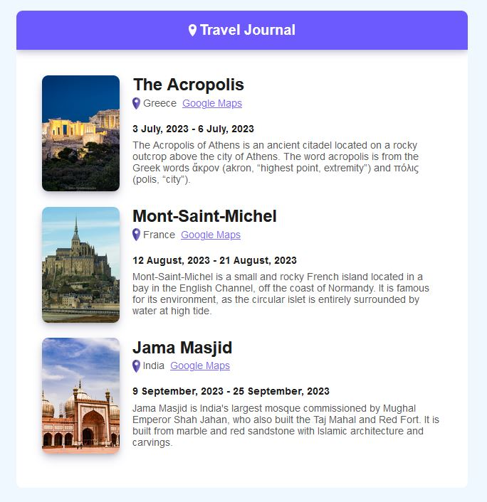

# Travel Journal - First React App

This is my [Firas Turak](https://www.linkedin.com/in/firasturak/) solution for a React based travel journal. It was my first project with React JS. The solution reads a local data file and maps the relevant data to their correct positions within reusable components "cards". The window is also fully responsive. In my next projects I plan to use fetch for data retrieval and hooks to expand my skills in React JS.

## Table of contents

- [Screenshot](#screenshot)
- [Links](#links)
- [What I learned](#what-i-learned)
- [Author](#author)

## Screenshot

## Links

- Solution URL: [Click 'View Deployment'](https://github.com/fturak/travel-journal-react/deployments/activity_log?environment=github-pages)

## What I learned
-JSX
-React JS
-Props
-Data mapping

## Author

- Website - [Firas Turak](https://www.linkedin.com/in/firasturak/)
